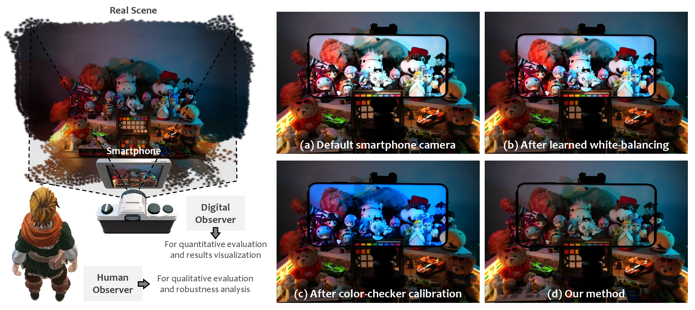
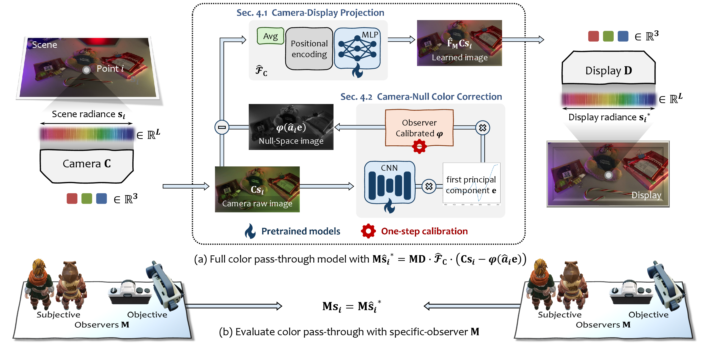
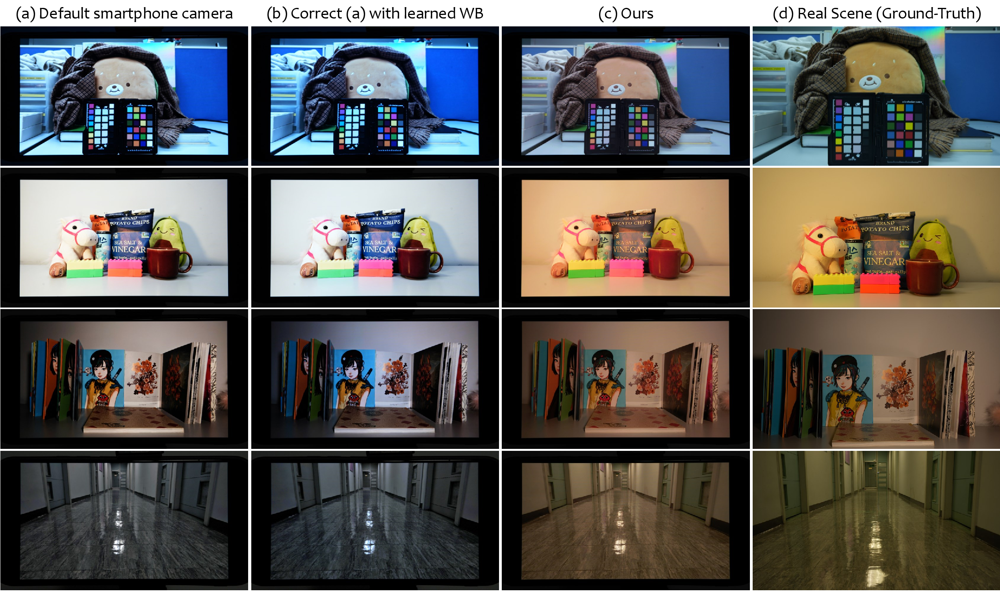

<div align="center">

# Color Pass-Through via Camera-Display Coupling

**Ruikang Li<sup>1</sup>, Molin Li<sup>2</sup>, Jiarui Wu<sup>1</sup>, Zhe Wei<sup>3</sup>, Pengpeng Liu<sup>3</sup>, Tianfan Xue<sup>1,†</sup>**

<sup>1</sup>CUHK MMLab &nbsp;&nbsp; <sup>2</sup>Zhejiang University &nbsp;&nbsp; <sup>3</sup>Central Media Technology Institute, Huawei  
<sup>†</sup>Corresponding author

**ECCV 2026**

[[Project Page]](https://lyricccco.github.io/color-pass-through/) &nbsp; [[Paper]](https://tianfan.info/papers/ECCV26_Color_Pass_Through.pdf) &nbsp; **[Code: Coming Soon]**



*Make a smartphone transparent, like Apple Vision Pro.*

</div>

## Overview

Color Pass-Through aims to make the image shown on a smartphone display perceptually match the real scene viewed through the device. Instead of calibrating the camera and display independently through a predefined intermediate color space, we learn the complete camera-display path end to end for each device.

Our method requires **no illumination priors** and **no pre-calibrated color space**. Two lightweight networks model the coupled imaging path, followed by a simple one-step calibration for each observer.

### Highlights

- **End-to-end camera-display coupling:** jointly model how scene colors are captured, transformed, and reproduced on a specific smartphone.
- **Lightweight and practical:** pre-train two compact networks for each phone model and perform only one-step observer calibration.
- **No handcrafted color pipeline:** remove the need for illumination estimation or a predefined CIE color transform.
- **Strong real-device results:** evaluated on commercial Huawei and Xiaomi smartphones under diverse, unseen illumination.
- **Consistent human and digital evaluation:** user preferences follow the same trend as DSLR-based measurements.

## Method

<div align="center">
  
</div>

The framework contains two complementary components:

1. **Camera-Display Projection** learns a nonlinear pixel-wise mapping from paired camera captures and display re-captures.
2. **Camera-Null Color Correction** predicts color information that cannot be uniquely recovered by the camera and adapts the correction to each observer with a compact calibration coefficient.

Together, they optimize one coupled path from the real scene to the displayed image.

## Visual Results

<div align="center">
  
</div>

Compared with a commercial smartphone pipeline and a learned white-balance baseline, Color Pass-Through more closely reproduces the color and brightness of the real scene across different environments.

## Evaluation Summary

- **+2.0 points** on a 5-point human user study.
- **More than 2× improvement** on quantitative metrics.
- **One-step calibration** for each observer.
- Average user-study ratings of **4.32/5 for brightness** and **4.03/5 for color** across unseen scenes.

More comparisons, quantitative tables, and observer studies are available on the [project page](https://lyricccco.github.io/color-pass-through/).

## Code Release

This repository currently hosts the project page. The training code, inference code, pretrained models, and calibration instructions are being organized and will be released soon.

## Citation

```bibtex
@inproceedings{li2026colorpassthrough,
  title     = {Color Pass-Through via Camera-Display Coupling},
  author    = {Li, Ruikang and Li, Molin and Wu, Jiarui and
               Wei, Zhe and Liu, Pengpeng and Xue, Tianfan},
  booktitle = {European Conference on Computer Vision (ECCV)},
  year      = {2026}
}
```

## License

The project page is released under the terms in [LICENSE](LICENSE). The license for the upcoming code and pretrained models will be specified with the code release.
