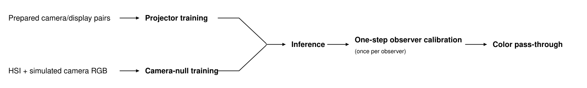

<div align="center">

# Color Pass-Through via Camera-Display Coupling

**Ruikang Li<sup>1</sup>, Molin Li<sup>2</sup>, Jiarui Wu<sup>1</sup>, Zhe Wei<sup>3</sup>, Pengpeng Liu<sup>3</sup>, Tianfan Xue<sup>1,†</sup>**

<sup>1</sup>CUHK MMLab &nbsp;&nbsp; <sup>2</sup>Zhejiang University &nbsp;&nbsp; <sup>3</sup>Central Media Technology Institute, Huawei  
<sup>†</sup>Corresponding author

**ECCV 2026**

<p>
  <a href="https://lyricccco.github.io/color-pass-through/">
    
  </a>
</p>
<p>
  <a href="https://arxiv.org/abs/2607.12746">
    
  </a>
  &nbsp;
  <a href="https://github.com/lyricccco/color-pass-through">
    
  </a>
</p>


<p><strong>Make a smartphone</strong> <strong><em>transparent</em></strong> <strong>Like Apple Vision Pro</strong></p>

</div>

## News

- **July 2026 — Code and models released.** The complete training and inference
  pipeline is now available, together with pretrained checkpoints for both
  supported devices.
- **Dataset release in progress.** We are preparing the canonical training
  package and optional preprocessing sources for public download.
- **Android toy example in development.** We are building a lightweight toy
  example that demonstrates the inference pipeline on Android.

## Overview

Color Pass-Through aims to make an image captured by a camera and reproduced on
a display perceptually match the real scene as viewed through the device.
Instead of calibrating the camera and display independently through a
predefined intermediate color space, we learn the complete camera-display path
end to end for each device.

In short, Color Pass-Through learns pretrained neural components for a fixed
camera-display pair, then uses a one-step calibration for each observer to
deliver color pass-through across diverse scenes.

## Introduction & motivation

This short introduction presents the problem setting, the limitations of
traditional camera-display calibration, and the motivation behind our coupled
learning framework.

[](./static/videos/Color-pass-through-intro.mp4)

<p align="center">
  <a href="./static/videos/Color-pass-through-intro.mp4"><strong>▶ Watch the introduction video</strong></a>
</p>

## Method

<div align="center">
  
</div>

The framework contains two complementary components:

1. **Camera-Display Projection** learns a nonlinear pixel-wise mapping from
   paired camera captures and display re-captures.
2. **Camera-Null Color Correction** predicts color information that cannot be
   uniquely recovered by the camera and adapts the correction to each observer
   with a compact calibration coefficient.

Together, they optimize one coupled path from the real scene to the displayed
image.



## Quick start

The default workflow uses the released canonical pairs. Rebuilding pairs from
original captures is optional and documented separately.

### 1. Create the environment

```bash
conda create -n color-pass-through python=3.10 pip -y
conda activate color-pass-through
pip install -r requirements.txt
```

See [Environment setup](docs/INSTALLATION.md) for CUDA checks and
troubleshooting.

### 2. Download and configure the data

After the dataset package is published, extract the **Core Training Data**
package and set:

```bash
export CPT_DATA_ROOT=/path/to/color-pass-through
export CPT_CONFIG=configs/devices/xiaomi_17promax.yaml
# Or: export CPT_CONFIG=configs/devices/huawei_pura70pro.yaml
```

The Core package is sufficient for training and inference. Original captures
and calibration inputs are needed only to reproduce preprocessing. RAFT,
DualDn, projector, and camera-null weights are bundled under `checkpoints/`.
See the [dataset guide](docs/data/README.md) for the complete layout.

### 3. Verify pretrained inference

```bash
python -m color_pass_through.cli.predict \
  --config "$CPT_CONFIG" \
  --input "$CPT_DATA_ROOT/projector/xiaomi_17promax/derived/v1/Image_Pairs_Flow/0900_CameraRaw.npy" \
  --phi 0.075 0.025 0.025 \
  --output runs/pretrained/xiaomi-output.png \
  --device cuda
```

The device configuration automatically selects its matching projector and
camera-null checkpoints. The example `phi` verifies execution; it is not a
universal observer calibration.

### 4. Train both learned components

```bash
python -m color_pass_through.cli.train_projector \
  --config "$CPT_CONFIG" --output runs/projector \
  --epochs 50 --batch-size 8 --workers 8 \
  --accelerator gpu --devices 1 --precision 16-mixed --seed 42

python -m color_pass_through.cli.train_camera_null \
  --config "$CPT_CONFIG" --output runs/camera-null \
  --epochs 50 --batch-size 4 --workers 4 --crop-size 256 \
  --accelerator gpu --devices 1 --precision 16-mixed --seed 42
```

Validation images, error maps, test predictions, metrics, and projector LUTs
are enabled by default. See the [training guide](docs/training/README.md) for
full controls and checkpoint export.

## Documentation

- [Environment setup](docs/INSTALLATION.md)
- [Dataset packages and layout](docs/data/README.md)
- [Training projector and camera-null models](docs/training/README.md)
- [Inference and observer coefficients](docs/inference/README.md)
- [Optional data-preparation overview](docs/preprocessing/README.md)
  - [Stage 1: calibration assets](docs/preprocessing/STAGE_1_CALIBRATION.md)
  - [Stage 2: aligned projector pairs](docs/preprocessing/STAGE_2_PROJECTOR_PAIRS.md)
- [Command-line tools](docs/tools/README.md)
- [Configuration reference](docs/CONFIGURATION.md)
- [Testing and contribution checks](docs/TESTING.md)

## Supported devices

- Xiaomi 17 Pro Max
- Huawei Pura 70 Pro

Device-dependent paths, RAW settings, model parameters, and observer search
ranges are defined in `configs/devices/*.yaml`. `dataset://` paths resolve
relative to `CPT_DATA_ROOT`; `repo://` paths resolve relative to this
repository.

## Visual results

<div align="center">
  
</div>

Compared with a commercial smartphone pipeline and a learned white-balance
baseline, Color Pass-Through more closely reproduces the color and brightness
of the real scene across different environments.

## Evaluation summary

- **+2.0 points** on a 5-point human user study.
- **More than 2× improvement** on quantitative metrics.
- **One-step calibration** for each observer.
- Average user-study ratings of **4.32/5 for brightness** and **4.03/5 for
  color** across unseen scenes.

More comparisons, quantitative tables, and observer studies are available on
the [project page](https://lyricccco.github.io/color-pass-through/).

## Citation

```bibtex
@inproceedings{li2026colorpassthrough,
  title     = {Color Pass-Through via Camera-Display Coupling},
  author    = {Li, Ruikang and Li, Molin and Wu, Jiarui and
               Wei, Zhe and Liu, Pengpeng and Xue, Tianfan},
  booktitle = {European Conference on Computer Vision (ECCV)},
  year      = {2026}
}
```

Machine-readable citation metadata is provided in [CITATION.cff](CITATION.cff).

## License

The project page and original implementation are released under
[LICENSE](LICENSE). Redistributed components, pretrained preprocessing models,
and datasets may have additional terms; consult
[THIRD_PARTY_LICENSES.md](THIRD_PARTY_LICENSES.md) before redistribution.
